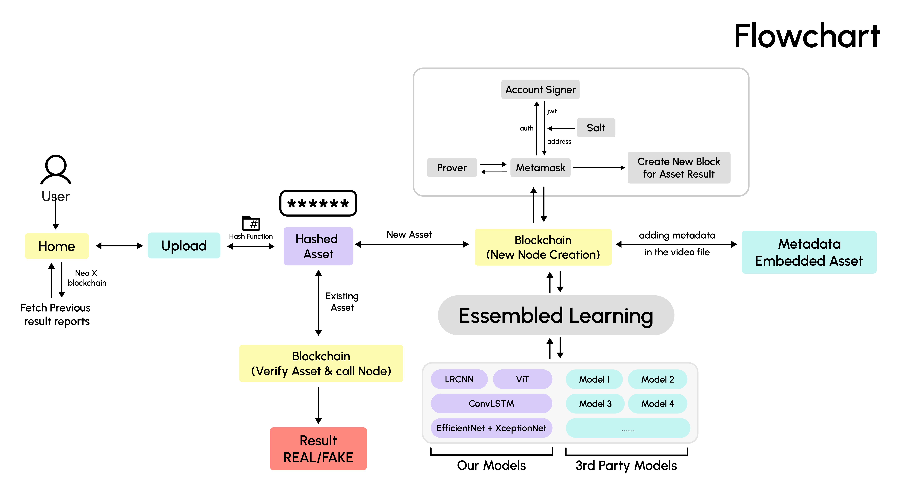

# DeepTrace

## Overview

Deepfakes and synthetic media are becoming increasingly sophisticated, creating a need for reliable detection mechanisms. This project addresses the challenge of verifying media authenticity using a multi-model approach.

This repository serves as a reference implementation for **backend orchestration of ML inference**. It demonstrates how to decouple heavy compute tasks (deepfake detection) from user-facing interactions using an asynchronous, event-driven architecture. The focus is on robust job management, state handling, and integrating heterogeneous services (Node.js, Python/PyTorch, MongoDB) rather than just the ML models themselves.

## Architecture

The system is composed of the following distinct modules:

*   **Frontend (React)**: User interface for video upload and status monitoring.
*   **Backend Orchestrator (Node.js + Express)**: Handles API requests, validation, and job creation.
*   **ML Worker (Flask + PyTorch)**: A dedicated, stateless worker that polls for jobs and performs CPU/GPU-intensive inference.
*   **MongoDB**: Acts as the central source of truth for job state (queue, processing, completion, failure).
*   **Blockchain (Optional)**: Anchors verification results for immutability (NeoX Testnet).



## Request Lifecycle

The system prioritizes non-blocking execution to handle long-running ML processes:

1.  **Upload**: User uploads a video via the React frontend.
2.  **Job Creation**: The Node.js orchestrator accepts the upload, saves the file locally, and creates a `Job` document in MongoDB with status `PENDING`. It immediately returns a `jobId` to the client.
3.  **Background Processing**: The ML Worker (Python) periodically polls MongoDB for `PENDING` jobs.
4.  **Job Claiming**: The worker atomically updates the job status to `PROCESSING` to prevent duplicate execution.
5.  **ML Inference**: The deepfake detection models run on the video content.
6.  **Completion**: Results are written back to MongoDB, and the status is updated to `COMPLETED`.
7.  **Result Retrieval**: The frontend polls the backend for job status and displays the final report once available.

## Backend Design Decisions

*   **Async Job Orchestration**: Utilizes MongoDB as a persistent queue instead of in-memory queues or Redis, simplifying deployment and state inspection.
*   **Stateless ML Worker**: The Python worker is decoupled from the web server. It can be restarted or scaled independently without affecting incoming HTTP requests.
*   **Atomic Job Claiming**: Uses `findOneAndUpdate` to ensure that only one worker picks up a specific job, preventing race conditions.
*   **Failure-Aware Job States**: explicitly handles error states (`FAILED`) to ensure the system doesn't stall on bad inputs.

## Tech Stack

*   **Backend**: Node.js, Express
*   **ML**: Python, Flask, PyTorch (Ensemble models), OpenCV
*   **Database**: MongoDB (Mongoose)
*   **Frontend**: React, Vite, TailwindCSS
*   **Blockchain**: Hardhat, Solidity (NeoX Testnet)

## Setup (Minimal)

This project is intended for code review and architecture discussion.

### Prerequisites
*   Node.js (v16+)
*   Python (3.8+)
*   MongoDB running locally

### Installation

1.  **Clone the repository**
    ```bash
    git clone https://github.com/NishCode17/DeepTrace
    cd DeepTrace
    ```

2.  **Start the Backend Orchestrator**
    ```bash
    cd Backend
    npm install
    npm run dev
    ```

3.  **Start the ML Worker**
    ```bash
    # In a new terminal
    pip install -r requirements.txt
    python models/app.py
    ```

4.  **Run Frontend**
    ```bash
    # In a new terminal
    npm install
    npm run dev
    ```

## What This Project Demonstrates

*   **Backend Orchestration**: Managing long-running processes without blocking the main event loop.
*   **Async ML Execution**: decoupling the API layer from the inference layer.
*   **Separation of Concerns**: distinctive roles for control (Node.js) and compute (Python).
*   **Robust State Management**: ensuring job states are tracked accurately across distributed components.

## Explicit Non-Goals

*   **Not Production-Scale**: The current polling mechanism is designed for simplicity, not high-throughput scale (which would require dedicated message queues).
*   **Not Distributed ML**: Training is not handled here; this is purely an inference pipeline.
*   **Not Federated Learning**: While the model architecture supports it theoretically, this implementation uses pre-trained weights.
